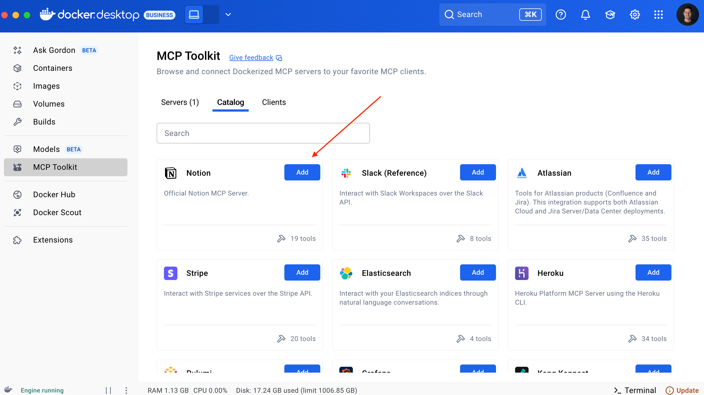
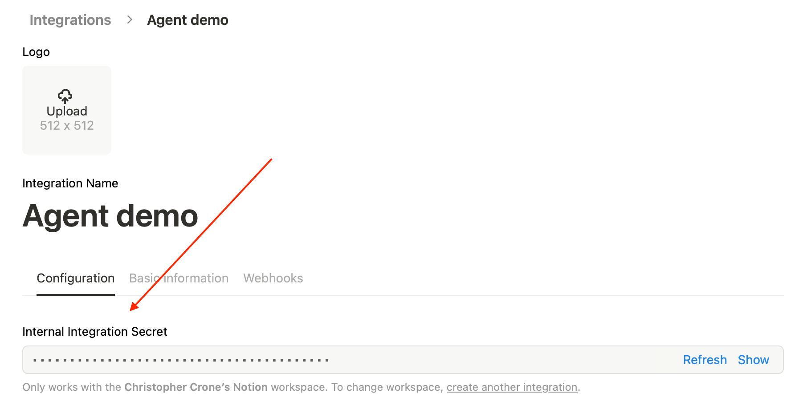
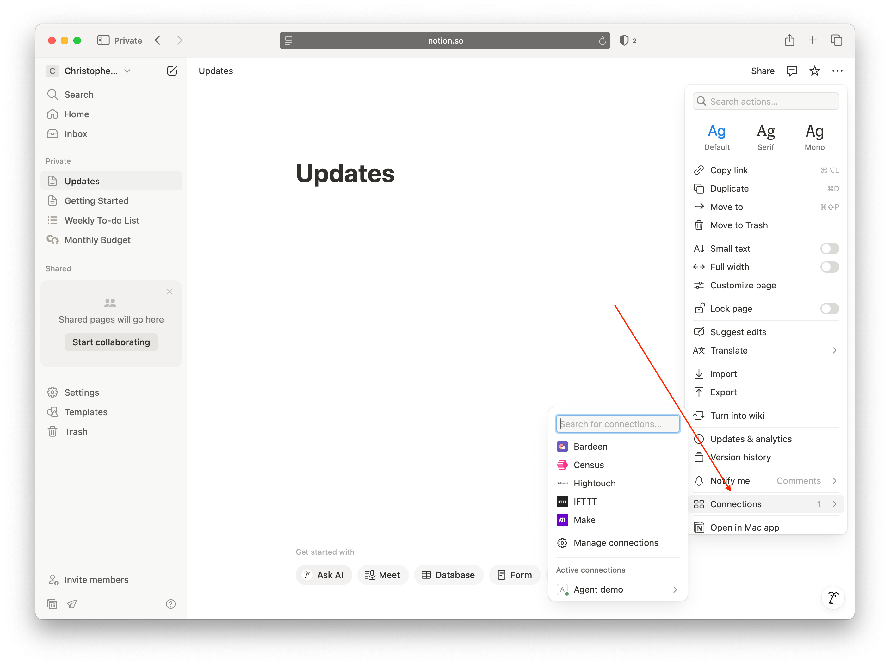
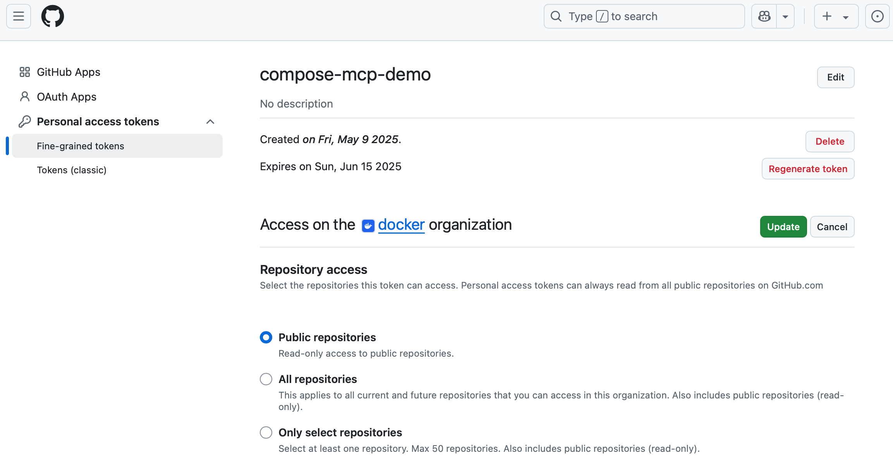
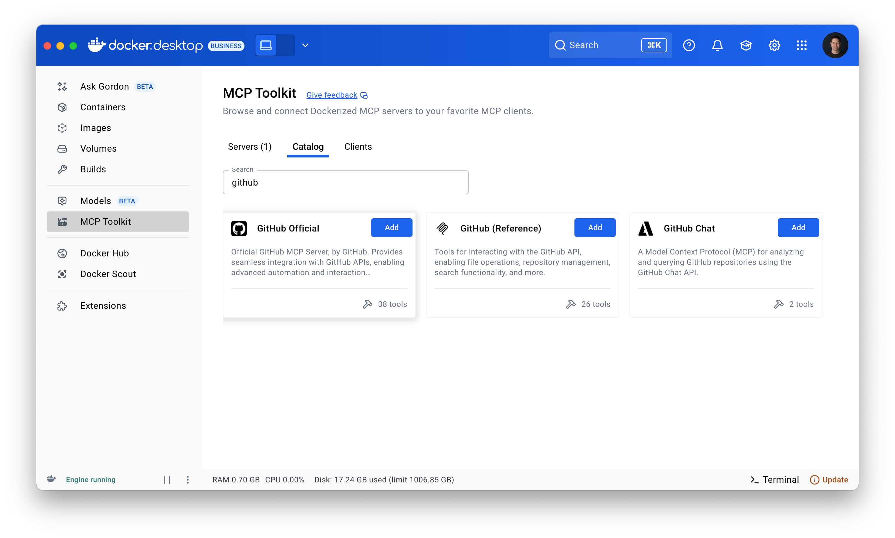

## OpenAI API Key

1. Generate a key by navigating to https://platform.openai.com/api-keys
1. Create a `.env` file and add your OpenAI API key to it:
```console
OPENAI_API_KEY=<KEY>
```
## Configure MCP Servers

+ Configure the following MCP Servers in the Docker Desktop extension (Desktop 4.41) or MCP Toolkit left nav (Desktop 4.42 nightly):
  + Notion
  + GitHub Official

### Notion

1. Create a new Notion account using a non-company email address
1. Create a new integration by navigating to https://www.notion.so/my-integrations
1. Follow the creation flow enabling write access
1. Add the Notion MCP Server in Docker Desktop

1. Copy the integration token into Desktop's MCP server configuration


1. Create a page named "Updates" in your workspace
1. Give your integration access to the page by clicking on the ... menu on the top right of the updates page, clicking "Connections" and selecting it


### GitHub Official

1. Create a fine grained personal access token: https://github.com/settings/personal-access-tokens
1. Give it read access to public repos

1. Add the "GitHub Official" MCP server

1. Add your token to it

## And Run!

Start the application:

```console
docker compose up --build
docker compose down --remove-orphans
```

**You can then see the agent UI on http://localhost:3000**


